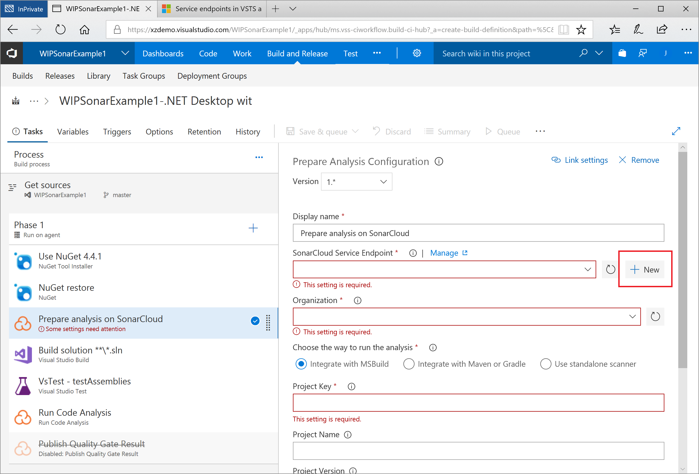

Last updated : {{ "now" | date: "%b %d,%Y" }}

## Overview

Technical debt is the set of problems in a development effort that make forward progress on customer value inefficient. Technical debt saps productivity by making code hard to understand, fragile, time-consuming to change, difficult to validate, and creates unplanned work that blocks progress. Unless they are managed, technical debt can accumulate and hurt the overall quality of the software and the productivity of the development team in the long term

[SonarCloud](https://about.sonarcloud.io/){:target="_blank"} an open source platform for continuous inspection of code quality to perform automatic reviews with static analysis of code to:

- Detect Bugs
- Code Smells
- Security Vulnerabilities
- Centralize Quality

### What's covered in this lab

In this lab, you will learn how to integrate Visual Studio Team Services with SonarCloud

- Setup a VSTS project and CI build to integrate with SonarCloud
- Analyze SonarCloud reports
- Integrate static analysis into the VSTS pull request process
- Add a dashboard widget to display the current quality of the project

### Prerequisites for the lab

1. You will need a **Visual Studio Team Services Account**. If you do not have one, you can sign up for free [here](https://www.visualstudio.com/products/visual-studio-team-services-vs){:target="_blank"}

1. A **Microsoft Work or School account, or a GitHub/BitBucket account**. SonarCloud supports logins using any of those types of account.

## Setting up the Environment

1. Install the SonarCloud VSTS extension to your VSTS account

    - install the SonarCloud extension from the [Visual Studio Marketplace](https://marketplace.visualstudio.com/items?itemName=SonarSource.sonarcloud){:target="_blank"}

    

   

   The SonarClound extension contains build tasks, build templates and a custom dashboard widget.

1. Create a new VSTS project for the lab
    
    - Create a new project in your VSTS account called **SonarExamples**

    - Import the **Sonar Scanning Examples repository** from GitHub at https://github.com/SonarSource/sonar-scanning-examples.git
    For detailed instructions see [here](https://docs.microsoft.com/en-us/vsts/git/import-git-repository?view=vsts){:target="_blank"}

    The scanning examples repository contains sample projects for a number of build systems and languages including C# with MSBuild, and Maven and Gradle with Java.

## Exercise 1: Set up a build definition that integrates with SonarCloud

We will set up a new build definition that integrates with SonarQube to analyze the SonarExamples code. As part of setting up the build definition we will create a SonarCloud account.

1. In your new VSTS project, Go to **Builds** under **Build and Release** tab, then click on _New_ to create a new build definition.

1. Click _Continue_ to accept the default values for _source_, _Team project_ _Repository_ and _Default branch_ 

   

1. Select the .NET Desktop with SonarCloud template.

    

    The template contains all of the necessary tasks and most of the required settings. We will now provide the values for the remaining settings.

1. Select the _Hosted VS2017_ agent queue 

    

1. Configure the _Prepare analysis on SonarCloud_ task

    

There are three settings that need to be configured:

   |Setting|Value|Notes|
   |---------|-----|-----|
   |**SonarCloud Service Endpoint**|SonarCloudSamples|The name of the VSTS endpoint that connects to SonarCloud|
   |** Organization **|_your SonarCloud org id_ |The unique key of your organization in SonarQube|
   |** Project Key **|_your SonarCloud org id_.netfxdemo |The unique key of the project in SonarQube|

1. Create a service endpoint for SonarCloud

A service endpoint holds the configuration information VSTS requires to connect to an external service, in this case SonarCloud.
There is a custom SonarCloud endpoint that requires two pieces of information: the identity of the organization in SonarCloud, and a
token that the VSTS build can use to connect to SonarCloud. We will create both while setting up the endpoint.

 - click on the _New_ button

    

1. Create a SonarCloud account

    

- click on the **your SonarCloud account security page** link

You will be taken to the SonarCLoud login page where you can choose the identity provider you want to use with SonarCloud: a Microsoft work or school account, a GitHub account, or a BitBucket account.

1. Select the identity provider to use

    

   

    

    After authorizing and logging in, we will be redirected to the **Generate token** page

    

1. Generate a token to allow VSTS to access your account on SonarCloud:

- enter a description name for the token e.g. "sonar_examples_token" and click _Generate_ 

- click _Copy_ to copy the new token to the clipboard

    

    

We have now created an organization on SonarCloud, and have the token needed configure the VSTS endpoint.

- return to VSTS _Add new SonarCloud Connection_ page, enter the SonarCloud token you have just created.
- click _Verify connection_ to check the endpoint is working, then click _OK_ to save the endpoint.

We can now finished configuring the _Prepare analysis on SonarCloud_ task.
- click on the _Organization_ drop-down and select your organization.

- enter a unique key for your project e.g. _myaccount-vsts-sonarexamples_
- enter a friendly name for the project e.g. _Sonar Examples_

1. [Optional] Enable the _Publish Quality Gate Result_ step
  This step is not required and is disabled by default.
  If this step is enabled, a summary of the analysis results will appear on the _Build Summary_ page. However, this will delay the completion of the build until the 
  processing on SonarCloud has finished.

1. Save and queue the build.

   

1. If you enabled the _Publish Quality Gate Result_ step above the Build Summary will contain a summary of the analysis report. 

   

1. Either click on the **Detailed SonarQube Report** link in the build summary to open the project in SonarCloud, or browse SonarCloud and view the project.

   

   We have now created a new organization on SonarCloud, and configured a VSTS build to perform analysis and push the results of the build to SonarCloud.

## Exercise 2: Analyze SonarQube Reports

Open the **Sonar Examples** project in the SonarQube Dashboard.  Under ***Bugs and Vulnerabilities***, we can see a bug has been caught.

**TODO - update images**

  

  The page has other metrics such as ***Code Smells***, ***Coverage***, ***Duplications*** and ***Size***. The following table briefly explains each of these terms.

   |Terms|Description|
   |-----|-----------|
   |**Bugs**|An issue that represents something wrong in the code. If this has not broken yet, it will, and probably at the worst possible moment. This needs to be fixed|
   |**Vulnerabilities**|A security-related issue which represents a potential backdoor for attackers|
   |**Code Smells**|A maintainability-related issue in the code. Leaving it as-is means that at best maintainers will have a harder time than they should making changes to the code. At worst, they'll be so confused by the state of the code that they'll introduce additional errors as they make changes|
   |**Coverage**|To determine what proportion of your project's code is actually being tested by tests such as unit tests, code coverage is used. To guard effectively against bugs, these tests should exercise or 'cover' a large proportion of your code|
   |**Duplications**|The duplications decoration shows which parts of the source code are duplicated|
   |**Size**|Provides the count of lines of code within the project including the number of statements, Functions, Classes, Files and Directories|

  

1. Click on the **Bugs** count to see the details of the bug.

   

   

## Exercise 3: Set up pull request integration

**TODO**

## Exercise 4: Add a dashboard widget

**TODO**

## Exercise 5: Configure Quality Gate

**TODO - recreate images for SonarCloud**

   Let us create a Quality Gate to enforce a policy which fails the gate if there are bugs in the code. A Quality Gate is a PASS/FAIL check on a code quality that must be enforced before releasing software.

1. Log in to SonarCloud and navigate to the **Sonar Examples** project

1. Click on **Quality Gates** menu and click **Create** in the Quality Gates screen.

   

   

1. Enter name for the Quality Gate and click **Create**.

   

1. Let us add a condition to check for the number of bugs in the code. Click on **Add Condition** drop down and select the value **Bugs**.

   

1. Change the **Operator** value to **is greater than** and the **ERROR** threshold value to **0** (zero) and click on the **Add** button.

   

   

1. To enforce this quality gate for **Sonar Examples** project, click on **All** under **Projects** section and select the project checkbox.

   

1. Now return to VSTS and queue a new build

   

**TODO**
1. You will see that the build has failed since the associated  **SonarQube Quality Gate** has **failed**. The  count of bugs is also displayed under **SonarQube Analysis Report**.

   

1. Click on the **Detailed SonarQube Report** link in the build summary to open the project in SonarQube.

   

1. You will see the error in line number 28 of **LoginServlet.java** file as **Make "List" serializable or don't store it in the session**.

   

1. The error is because the session attribute accepts only serialized objects. This can be fixed by explicitly casting the list object to serializable. Lets fix this bug -

   Go to below path to edit the file in **VSTS** code tab:-

   >src/main/java/com/microsoft/example/servlet/LoginServlet.java

   Make the following changes in the code as shown:

   - Go to line number **28** and replace the existing code with below snippet.

      >session.setAttribute("employeeList", (Serializable)fareList);

      

   - Import the below package.

      >import java.io.Serializable;

      

1. Commit the changes.

1. Once the CI build completes, you will see the Quality Gate as **Passed** in the build summary along with a brief view of **Test Results**, **Code Coverage** and link to SonarQube Analysis Report.

   

1. Go to SonarQube portal. You will see the bug count is **0**.

   

## Summary

With  the **SonarCloud** extension for **Visual Studio Team Services**, you can embed automated testing in your CI/CD pipleine to automate the measurement of your technical debt including code semantics, testing coverage, vulnerabilities. etc. You can also integrate the analysis into the VSTS pull request process so that issues are discovered before they are merged.
